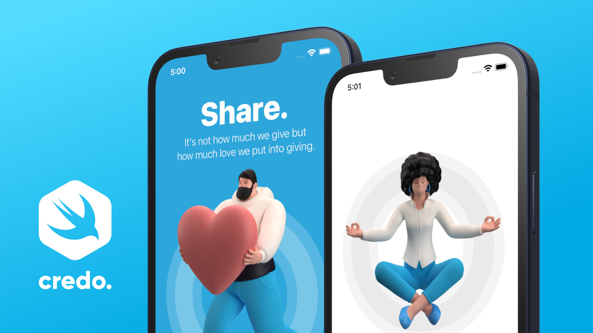
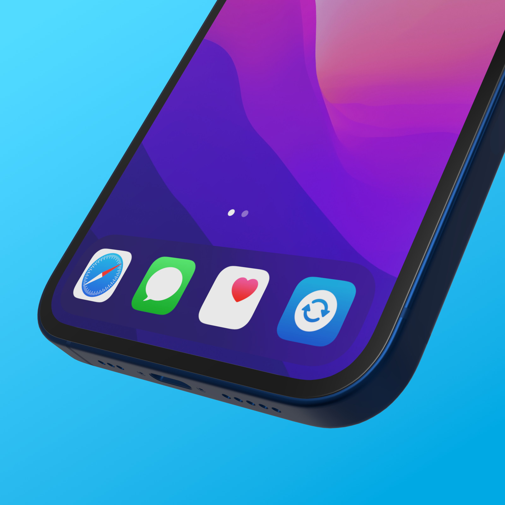
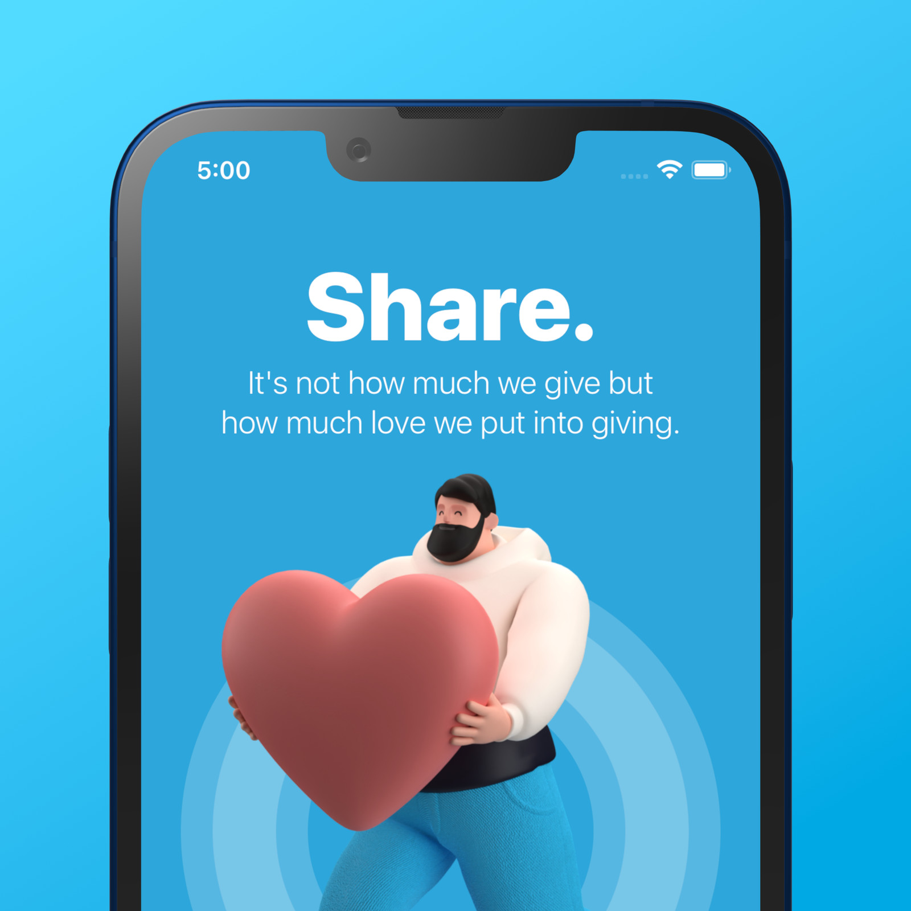
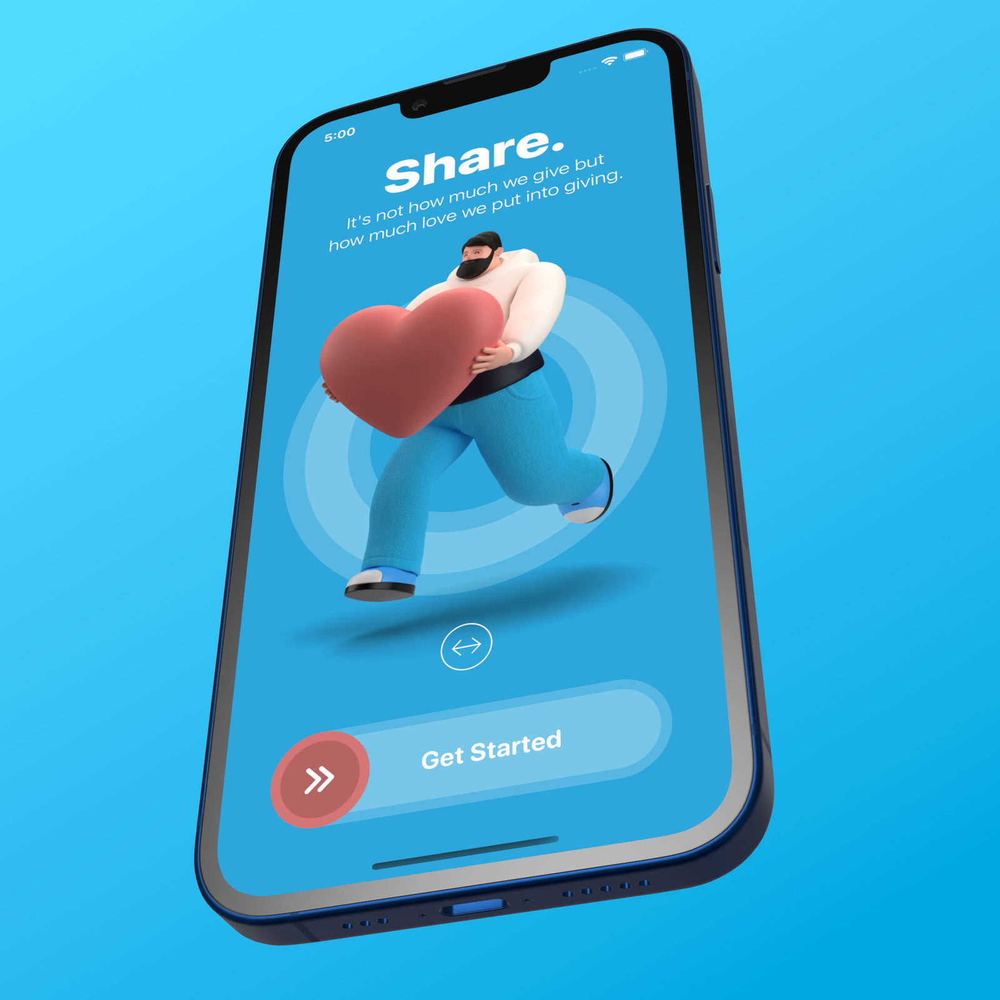
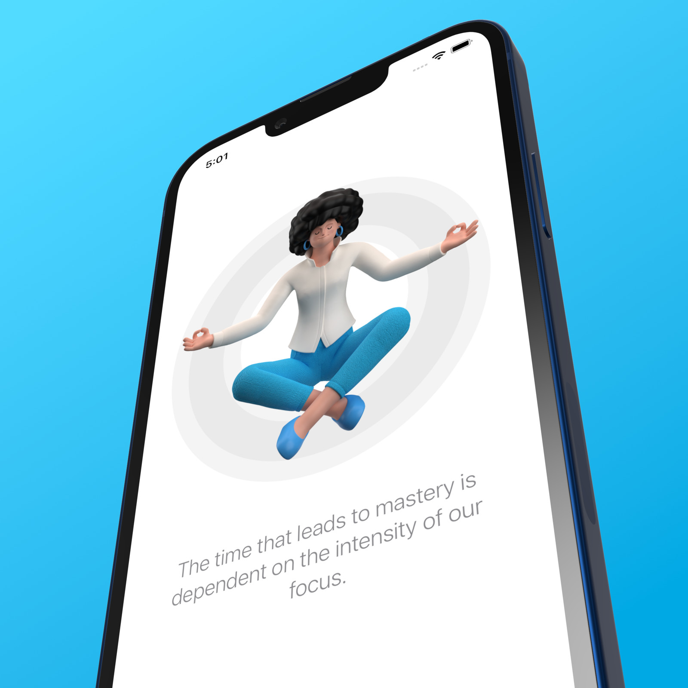
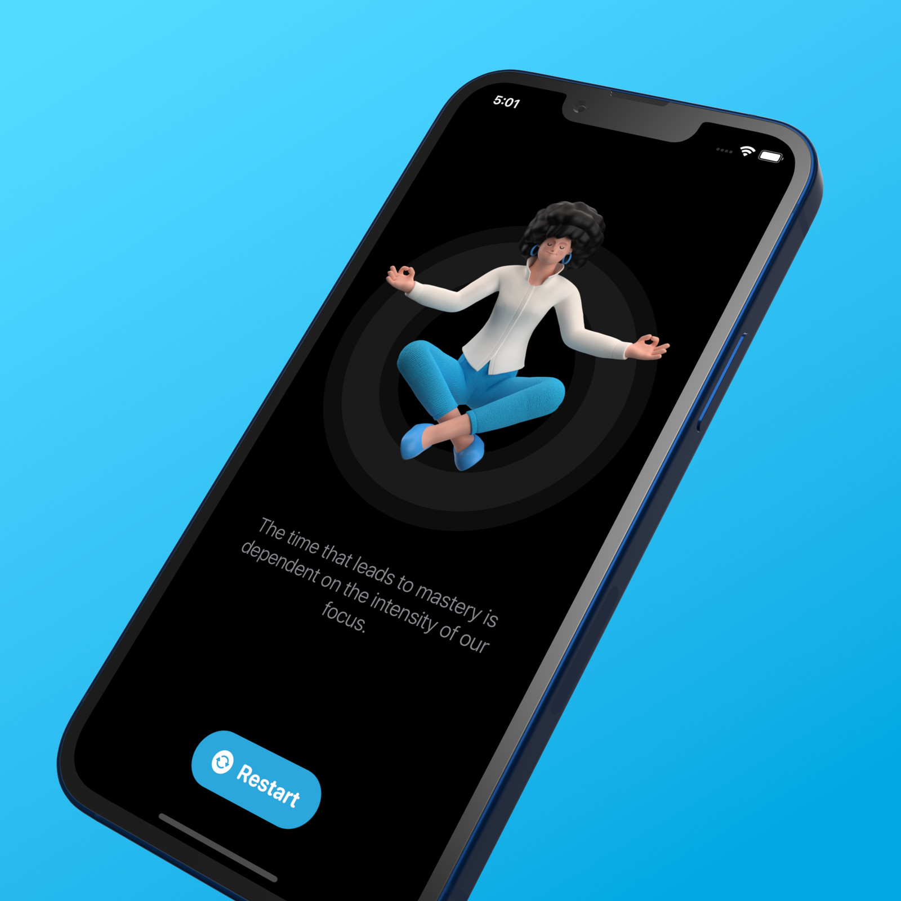
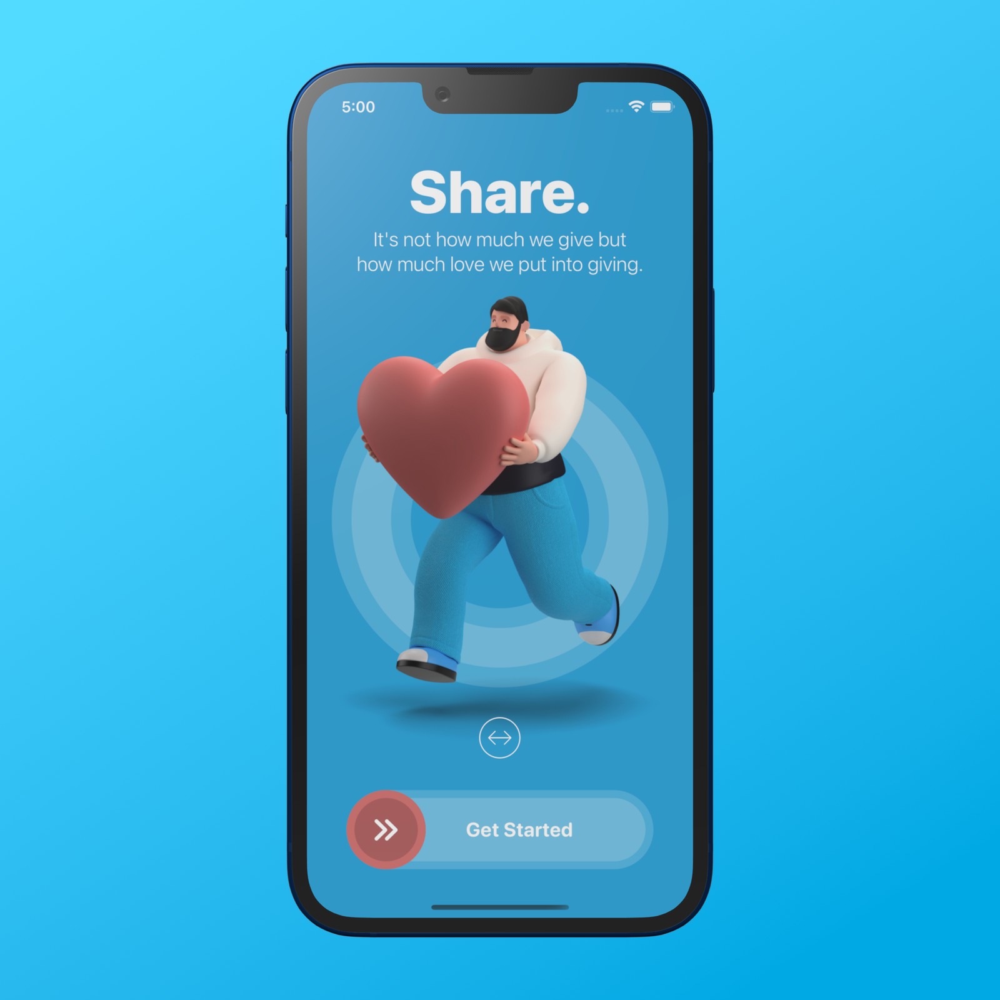
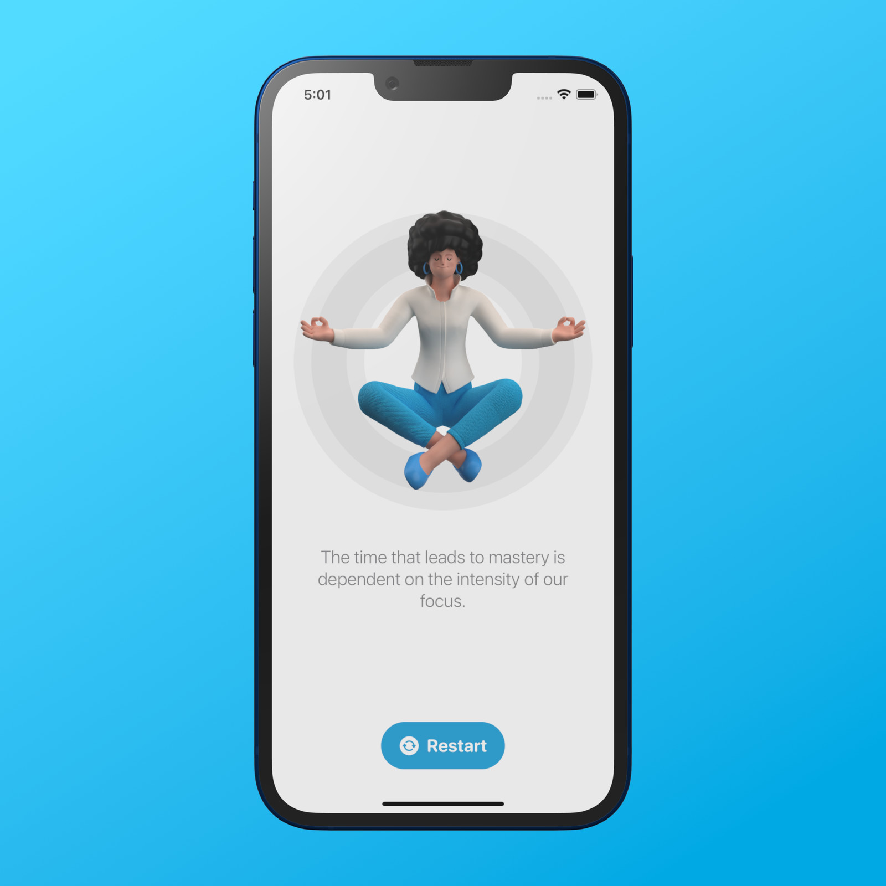

# RESTART APP

## Main learning objectives of this SwiftUI 3 project

Sometimes we feel discouraged. Sometimes we are vastly disappointed too. If so, by practicing solitude we can feel better and focused. This is when we create amazing things. Please join me to develop this beautiful iOS application with SwiftUI.

### ADVANCED APP DESIGN

The main goal of this mini project is to inspire you on what we can accomplish with the SwiftUI framework.

### COMPLEX SWIFTUI GESTURES

We will create such a custom button with complex gestures that we can not find in Apple’s stock user interface library.

### PARALLAX EFFECT

By using multiple movements in the opposite direction (parallax effect) we can add depth to this amazing onboarding screen.

App Icon makes the first impression on the users' mobile devices. We could not take shortcuts without it if we want to upload our application to Apple's App Store.

Do you want to learn advanced iOS 15 app design with the SwiftUI 3 Framework? Then this hands-on tutorial is for you. Let's learn how to create an iOS 15 app design with Apple's SwiftUI framework.

Complex iPhone application

The home screen is made with SwiftUI

Dark mode

Parallax effect and animation

Using app storage to restart the iPhone application
